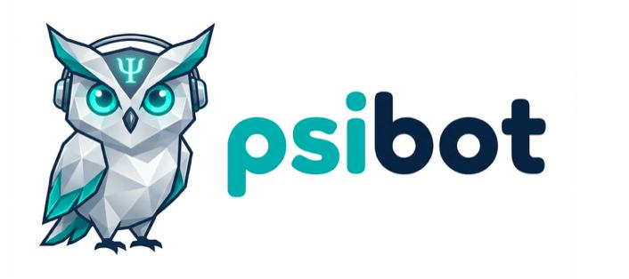
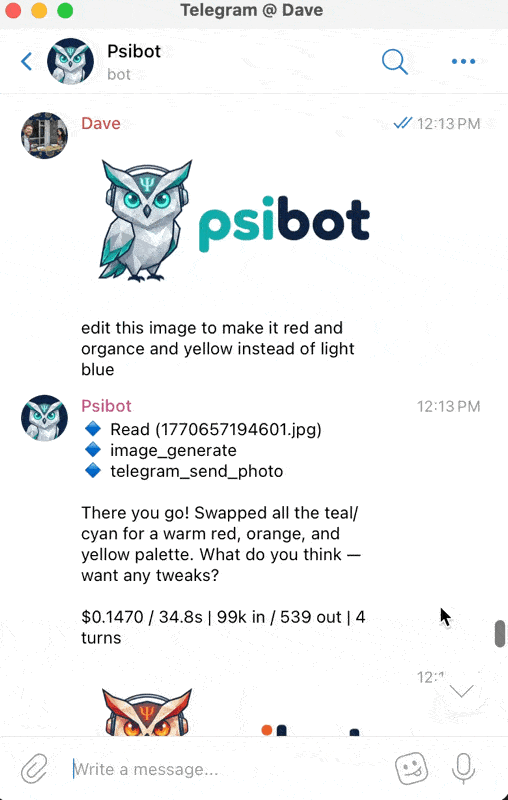
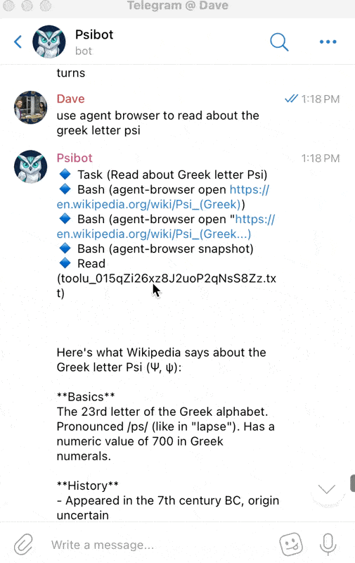
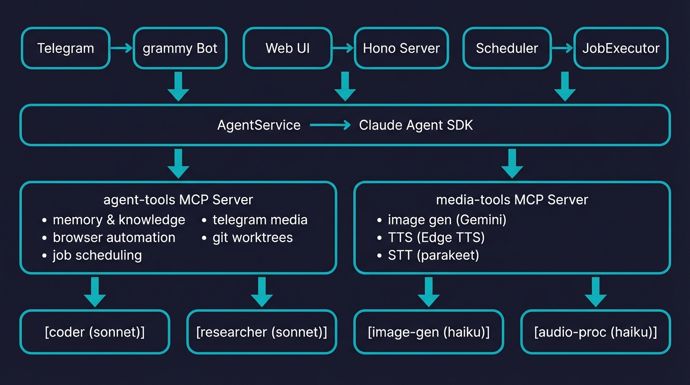

<div align="center">
  
  <h1>🦉 psibot: Personal AI Assistant for Telegram</h1>
  <p>
    
    
    
    
    
  </p>
</div>

A persistent personal AI assistant that runs on your own hardware. Chat through Telegram, manage it through a web dashboard, and let it handle tasks autonomously on a schedule.

**Built on the [Claude Agent SDK](https://github.com/anthropics/claude-agent-sdk)** &mdash; uses OAuth with your existing Claude Max subscription. No separate API keys to manage, no per-token billing, no surprise costs. If you're already paying for Max, psibot is effectively free to run.

## ✨ Key Features

**Always On** &mdash; Runs as a macOS LaunchAgent daemon. Survives reboots, handles wake/sleep cycles, and stays connected to Telegram 24/7.

**Multimodal** &mdash; Send text, voice messages, and photos through Telegram. Generates images (Gemini API), converts text-to-speech (Edge TTS), and transcribes audio (parakeet STT).

**Persistent Memory** &mdash; Maintains knowledge files, daily logs, and structured memory across sessions. Learns about you over time and remembers context between conversations.

**Autonomous Agents** &mdash; Spawns specialized subagents for different tasks: a coder (works in isolated git worktrees), a researcher (browser automation), an image generator, and an audio processor.

**Scheduled Tasks** &mdash; Cron-based job scheduling with budget controls. Set up periodic maintenance, reminders, or any recurring prompt with configurable quiet hours.

**Web Dashboard** &mdash; HTMX + SSE streaming interface for real-time chat, job management, memory browsing, and log viewing.

**MCP Tool Ecosystem** &mdash; Extensible via Model Context Protocol servers. Built-in tools for memory management, browser automation, Telegram media, git worktrees, Google Workspace, Apple Reminders, and GitHub.

<table align="center">
  <tr align="center">
    <th><p align="center">🎨 Image Editing</p></th>
    <th><p align="center">🌐 Browser Automation</p></th>
    <th><p align="center">🔊 Agentic Audio</p></th>
  </tr>
  <tr>
    <td align="center"><p align="center"></p></td>
    <td align="center"><p align="center"></p></td>
    <td align="center"><p align="center"><video src="https://github.com/DmacMcgreg/psibot/raw/main/agentic_audio.mp4" width="300" autoplay loop muted playsinline></video></p></td>
  </tr>
  <tr>
    <td align="center">Generate &bull; Edit &bull; Send</td>
    <td align="center">Navigate &bull; Read &bull; Research</td>
    <td align="center">Transcribe &bull; Speak &bull; Listen</td>
  </tr>
</table>

## 💡 Why Claude Agent SDK?

Most AI agent frameworks require you to manage API keys and pay per-token for every model call. psibot takes a different approach:

- **Uses your Claude Max subscription** via OAuth &mdash; the SDK authenticates through the `claude` CLI, so there's no `ANTHROPIC_API_KEY` to configure
- **No per-token costs** &mdash; your Max subscription covers all agent runs, subagent spawns, and tool calls
- **No risk of unexpected bills** &mdash; unlike pay-per-use APIs, your costs are fixed and predictable
- **Full model access** &mdash; use Opus, Sonnet, or Haiku for different subagents based on task complexity

## 🏗️ Architecture

<p align="center">
  
</p>

## 🚀 Quick Start

### Prerequisites

- [Bun](https://bun.sh) runtime
- [Claude CLI](https://github.com/anthropics/claude-code) (`npm install -g @anthropic-ai/claude-code`) &mdash; authenticated with `claude login`
- A [Telegram bot token](https://core.telegram.org/bots#botfather)

### Optional Dependencies

| Tool | Purpose | Install |
|------|---------|---------|
| [uv](https://github.com/astral-sh/uv) | Python tool runner for audio tools | `curl -LsSf https://astral.sh/uv/install.sh \| sh` |
| [mlx-audio](https://github.com/lucasnewman/mlx-audio) | STT (parakeet) on Apple Silicon | `uv tool install mlx-audio` |
| [edge-tts](https://github.com/rany2/edge-tts) | Text-to-speech via Microsoft Edge neural voices | `pip install edge-tts` |
| [Gemini API key](https://ai.google.dev) | Image generation via Gemini | Set `GEMINI_API_KEY` in `.env` |
| [Tailscale](https://tailscale.com) | Remote access to web dashboard + Funnel for webhooks + Wake-on-LAN packets | Install from [tailscale.com/download](https://tailscale.com/download) |

### 1. Clone and install

```bash
git clone https://github.com/DmacMcgreg/psibot.git
cd psibot
bun install
bun link          # Makes the 'psibot' command available globally
```

### 2. Configure

```bash
cp .env.example .env
```

Edit `.env` with your settings:

```env
# Telegram
TELEGRAM_BOT_TOKEN=123456:ABC-DEF...
ALLOWED_TELEGRAM_USER_IDS=123456789

# Server
PORT=3141

# Agent
DEFAULT_MODEL=claude-opus-4-6
```

### 3. Run

```bash
# Development (with hot reload)
bun run dev

# Production
bun run start
```

### 4. Deploy as daemon (macOS)

```bash
psibot install   # Install LaunchAgent
psibot start     # Start the daemon
psibot status    # Check status
psibot logs      # Tail logs
```

## ⚙️ Configuration

### Environment Variables

| Variable | Default | Description |
|---|---|---|
| `TELEGRAM_BOT_TOKEN` | (required) | Telegram bot API token |
| `ALLOWED_TELEGRAM_USER_IDS` | (required) | Comma-separated authorized user IDs |
| `PORT` | `3141` | Web dashboard port |
| `DEFAULT_MODEL` | `claude-opus-4-6` | Model for the main agent |
| `DEFAULT_MAX_BUDGET_USD` | `1.00` | Max cost per agent run |
| `HEARTBEAT_ENABLED` | `true` | Enable periodic autonomous heartbeat |
| `HEARTBEAT_INTERVAL_MINUTES` | `30` | Minutes between heartbeats |
| `HEARTBEAT_QUIET_START` | `23` | Quiet hours start (hour, 24h) |
| `HEARTBEAT_QUIET_END` | `8` | Quiet hours end (hour, 24h) |
| `HEARTBEAT_MAX_BUDGET_USD` | `0.50` | Max cost per heartbeat run |
| `PSIBOT_DIR` | `~/.psibot` | Worktree and repo storage |

### Webhook Mode (Optional)

For reliable message delivery through network changes and sleep/wake cycles, enable webhook mode via Tailscale Funnel:

```env
TELEGRAM_WEBHOOK_ENABLED=true
TELEGRAM_WEBHOOK_HOST=your-machine.tailnet-name.ts.net
TELEGRAM_WEBHOOK_PORT=8443
```

## 💬 Telegram Commands

| Command | Description |
|---------|-------------|
| `/ask <prompt>` | Send a message to the agent |
| `/jobs` | List scheduled jobs |
| `/memory` | Browse agent memory |
| `/status` | Show system status |
| `/verbose` | Toggle tool call feedback |

Send **voice messages** for automatic transcription and response. Send **photos** with optional captions for image-aware conversations.

## 📁 Project Structure

```
src/
  index.ts                  # Entry point
  config.ts                 # Zod-validated env config
  agent/
    index.ts                # AgentService (query with MCP + subagents)
    tools.ts                # agent-tools MCP server
    media-tools.ts          # media-tools MCP server
    subagents.ts            # Subagent definitions
    prompts.ts              # System prompt builder
  telegram/
    index.ts                # Bot setup + auth middleware
    commands.ts             # Command & media handlers
    format.ts               # Message formatting
    webhook.ts              # Webhook mode (Tailscale Funnel)
  web/
    index.ts                # Hono app + IP allowlist
    routes/                 # Chat, jobs, memory, logs
    views/                  # HTMX templates
  heartbeat/
    index.ts                # Periodic autonomous tasks
  scheduler/
    index.ts                # Cron + one-off job scheduling
    executor.ts             # Job execution via agent
  memory/
    index.ts                # Knowledge files, search, daily logs
  browser/
    index.ts                # Browser automation wrapper
  db/
    index.ts                # SQLite (WAL mode)
    schema.ts               # Migrations
    queries.ts              # Prepared statements
  shared/
    types.ts                # Type definitions
    logger.ts               # Timestamped logging
knowledge/
  IDENTITY.md               # Agent persona
  USER.md                   # Learned user context
  TOOLS.md                  # Tool documentation
  HEARTBEAT.md              # Maintenance task definitions
  memory.md                 # Persistent memory
  memory/                   # Daily logs
data/
  app.db                    # SQLite database
  images/                   # Generated images
  audio/                    # TTS output
  media/                    # Inbound Telegram media
```

## 🧱 Stack

| Component | Technology |
|-----------|-----------|
| Runtime | [Bun](https://bun.sh) |
| Agent | [@anthropic-ai/claude-agent-sdk](https://github.com/anthropics/claude-agent-sdk) |
| Bot | [grammy](https://grammy.dev) |
| Web | [Hono](https://hono.dev) + HTMX + SSE |
| Database | SQLite (bun:sqlite, WAL mode, FTS) |
| Scheduling | [croner](https://github.com/hexagon/croner) |
| Validation | [Zod](https://zod.dev) |
| Image Gen | [Gemini API](https://ai.google.dev) |
| TTS | [Edge TTS](https://github.com/rany2/edge-tts) (Sonia British neural voice) |
| STT | [parakeet](https://docs.nvidia.com/nemo-framework/user-guide/latest/nemotoolkit/asr/models.html#parakeet) (via mlx-audio) |
| Browser | [agent-browser](https://github.com/anthropics/agent-browser) |

## Notes

- **macOS Full Disk Access**: If the project lives in `~/Documents` (or `~/Desktop`, `~/Downloads`), Bun needs Full Disk Access. Grant it in **System Settings > Privacy & Security > Full Disk Access**, then add the Bun binary (typically `/opt/homebrew/bin/bun`). Without this, the daemon will fail with TCC permission errors.
- **mlx-audio PATH**: `uv tool install mlx-audio` places commands in `~/.local/bin/`. The launcher script includes this in PATH automatically, but your interactive shell also needs it &mdash; `uv` adds it to your shell profile during installation.
- **LaunchAgent quirk**: The launcher script uses `bun --cwd` instead of plist `WorkingDirectory` to avoid a Bun `getcwd()` deadlock under launchd
- **PATH for launchd**: The launcher exports `~/.local/bin` and `/opt/homebrew/bin` &mdash; needed for mlx-audio commands and the `claude` CLI (Agent SDK OAuth)

## License

MIT
